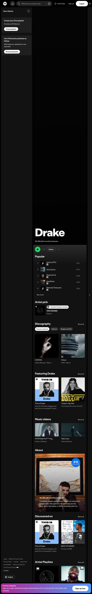
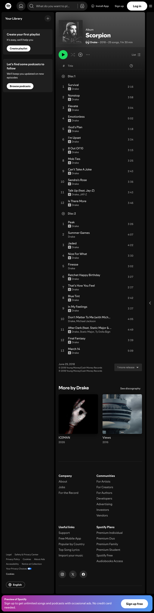
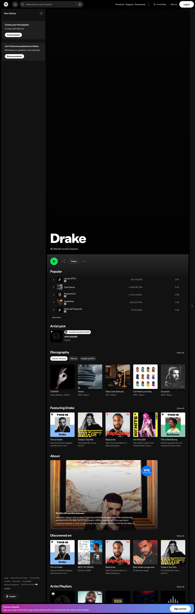
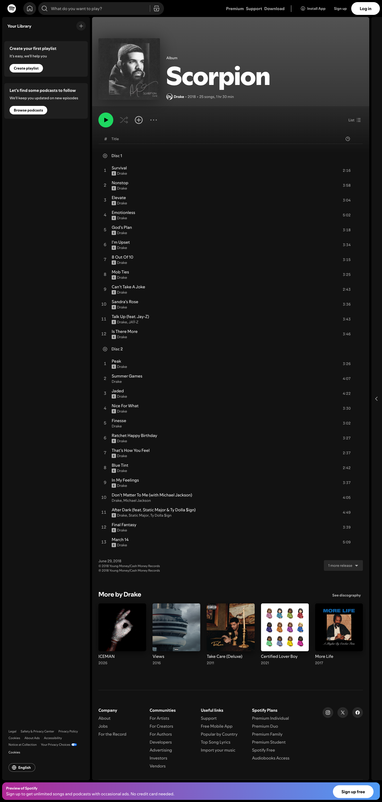
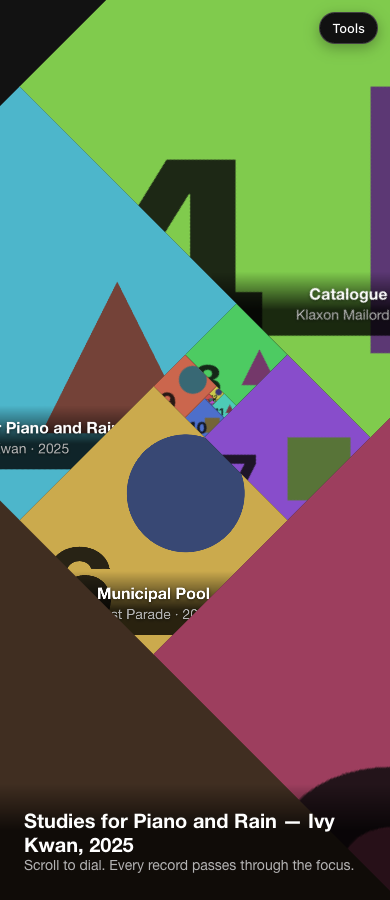
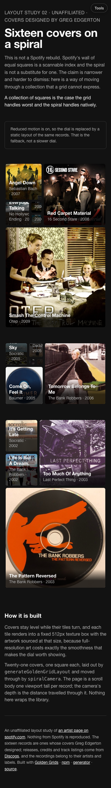
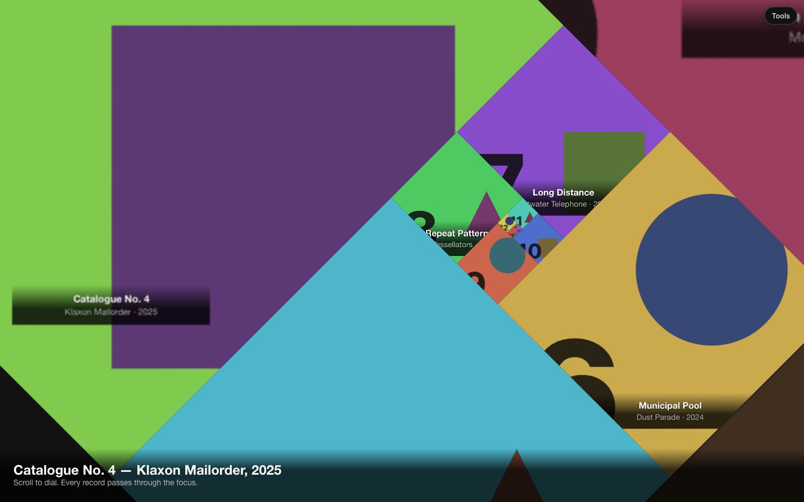
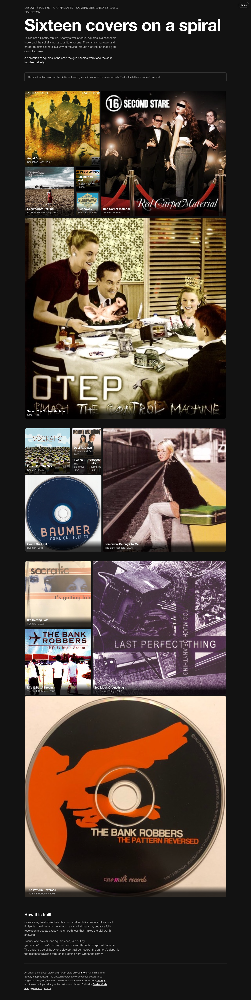

# Layout study 02 — a collection on the spiral dial

**Live:** https://gregoryedgerton.github.io/golden-grids-study-02-spotify/

> **This is not a rebuild.** Spotify's wall of equal squares is a scannable
> index and the spiral is not a substitute for one. The claim is narrower and
> harder to dismiss: here is a way of moving through a collection that a grid
> cannot express.

An unaffiliated layout study. It names the page it argues with, takes the same
kind of content — a collection of square covers — and shows what the grid
cannot do with it. The artists, albums and artwork are invented for this
study. Nothing from Spotify or from any real release is reproduced.

Built with [Golden Grids](https://github.com/gregoryedgerton/golden-grids)
([npm](https://www.npmjs.com/package/@gifcommit/golden-grids) ·
[generator](https://gregoryedgerton.github.io/golden-grids/)), from the
[study template](https://github.com/gregoryedgerton/golden-grids-study-template).

> **Status: pass one.** The dial is built and every slot is inventoried in the
> asset spec below. The twenty-one covers are generated stand-ins at the exact
> dimension the real artwork must be. Pass two replaces them; the shot list is
> [`ASSETS.md`](ASSETS.md).

---

## Reference

**Page:** an artist page on open.spotify.com — the rows of equal album squares
(Discography, Featuring, Discovered on, Artist Playlists).
https://open.spotify.com/artist/3TVXtAsR1Inumwj472S9r4

**Captured:** 2026-09-15, signed out, at 390 / 820 / 1440. Spotify scrolls an
inner container rather than the document, so the capture script scrolls the
tallest scroller and then grows the viewport to its height;
[`captures/capture.cjs`](captures/capture.cjs) does both.

| Width | Reference (artist page) | Reference (album page) |
| --- | --- | --- |
| 390px |  |  |
| 820px |  |  |
| 1440px |  |  |

## The claim

A collection of squares is the case the grid handles worst and the spiral
handles natively.

The reference's rows assert that every record carries equal weight, which is
false the moment anyone scrolls: the row exists because some records are being
surfaced. More than that, a grid of equal squares has no way to express
*distance*. Nothing in it says "this record is four years further back than
that one". The spiral does that with size alone, and a scroll walks it.

## Why album covers

Album art is square and Fibonacci tiles are square, so nothing is lost. That
is a content argument, not a production one — the slot crops either way, so
the question is not whether cropping is *work* but whether cropping *destroys
something*. A photograph is a composition; take a square out of the middle of
a landscape and the composition goes with the sixty percent you discarded.
Album art has no outside to lose. It is also designed to survive thumbnail
scale, which is exactly the demand the dial makes of it.

## Structure

No bands. The page is one deep layout driven by the spiral camera:

- `generateGoldenGridLayout` lays out twenty-one squares, one per record,
  rotated by `trailToRotateDeg` so the spiral grows into the open side of the
  stage — right when the stage is landscape, down when it is portrait. The
  direction cycles with the square count as well as the rotation, so it is
  solved rather than fixed.
- The page is a scroll body one viewport tall per record with a sticky,
  viewport-tall stage inside it. The camera's depth is the distance travelled
  through that body, so one viewport of scroll is one record.
- `spiralCamera` is called at `fillRatio: 1` and the focus is anchored flush
  into the stage's top-left corner, so all of the leftover room lies on one
  axis and the rest of the collection grows into it. Centring the focus at the
  default 0.62 leaves a margin on all four sides of a wide stage and the
  spiral floats in it.
- Each tile carries its own `toCssTileTransform`. There is deliberately no
  transform on the stage: a scaled stage layer forces every tile through one
  clamped raster and the deep dial goes soft.
- `spiralWindow` fades the far tail and `tileOnScreen` culls whatever has left
  the stage; a sub-pixel check drops the deepest records at shallow depths.
  Between twelve and fourteen tiles paint at any moment, out of twenty-one.

Nothing wraps the library. `spiralCamera`, `spiralWindow`, `tileOnScreen`,
`toCssTileTransform`, `toCssContentTransform` and `trailToRotateDeg` are
called directly, in the order the library's own `docs/spiral-dial.md`
prescribes.

## The two decisions

The brief asks for both to be made early and stated.

**1. The covers stay level.** Both versions were built and the level one won.
Turning art is the more dramatic still, but in motion a cover that spins reads
as a spinning picture rather than as a record you are moving past, and
twenty-one of them turning at once is a great deal of rotation on screen.

`toCssContentTransform(frame)` on the artwork does it: counter-rotation about
the tile's own centre — unlike the tile matrix, which assumes a zero origin —
plus the |cos| + |sin| cover swell that keeps the rotated square filling its
clip box, exactly 1 at rest and √2 at worst. The label is held level the same
way without the swell, sits on the tile's centre line, and is scaled back up
by the tile's net scale; a corner-anchored label is cut off by the square clip
box the moment the dial turns. `{ counterRotate: false }` is the turning
version, one argument away.

**2. The artwork is sourced at the tile's texture box.** Every tile renders
into a fixed 512px box and the camera scales that box, so full-resolution art
costs exactly the smoothness that makes the dial worth showing. `TEXTURE_PX`
in `src/assets.ts` is the single source of that number and the asset spec
quotes it.

## Clicking a record

Every cover is a control. Clicking one opens that record, and the track list
is laid out as a golden grid of its own — a second, nested use of the library
inside the thing the dial was showing. Five tracks, largest box first: the
same descent the collection uses, one scale down.

The track grid's `placement` follows the track count rather than being fixed,
because `right` and `left` give a landscape band only at an even box count and
`top` and `bottom` only at an odd one. Five tracks under `right` would be a
5:8 portrait and the opening track would fall off the bottom of the panel.

It is a dialog rather than an expanded cell, because the dial is a sticky,
viewport-tall stage that cannot grow the way a band can. It covers the stage,
takes focus, makes the stage `inert`, locks the page scroll — the dial's depth
*is* the scroll position, so leaving it live would spin the stage behind the
panel — and gives all of it back on close, with focus returning to the cover
that opened it. Escape closes.

## Reduced motion

Scroll-bound rotation is genuinely unpleasant for some people, so
`prefers-reduced-motion` produces a real static layout of the same twenty-one
records — four stacked golden grids, largest record first — not a slower dial.
The page says which one it is showing.

The study tools panel carries a **Reduced motion** switch (`m`) so the
fallback can be seen and captured without changing a system setting;
`?motion=1` does the same for one load.

| | Dial | Reduced motion |
| --- | --- | --- |
| 390px |  |  |
| 1440px |  |  |

Stills at four depths and three widths are in `captures/dial-*.png`;
[`captures/dial.cjs`](captures/dial.cjs) takes them.

## Visual register

The structure is the argument, so everything that is not structure is held
constant: the study uses the reference's own palette and type, measured from
the live page on 2026-09-15 (`captures/tokens.cjs` →
`captures/reference-tokens.json`).

| Token | Reference (measured) | Study |
| --- | --- | --- |
| Face | SpotifyMixUI, falling back to Helvetica Neue, helvetica, arial | the same fallback stack; the face is proprietary and is not shipped |
| Ground | `#121212`; cards `#1f1f1f`, hover `#282828`; lines `#333333` | same |
| Text | white primary, `#b3b3b3` secondary | same |
| Accent | `#1ed760`, the one accent colour | same, on focus rings |
| Body | 16px 400 | same |
| Section heading | 24px 700 (20px at 390) | same |
| Display | 96px 800 (the artist name) | the study's title, at the same role |
| Secondary line | 14px 400 (13px at 390) | same |
| Cover radius | 6px | 6px in the static layout; 0 on the dial, where the tiles tile the plane |
| Pills | 9999px | same |

Colour scheme is dark only, as the reference has no light one.

## Asset spec

The handoff artifact. Pass one ends here: the dial is built and every slot is
inventoried. Pass two replaces the stand-ins with original artwork. The shot
list with one prompt per cover is [`ASSETS.md`](ASSETS.md).

**Count:** 21. **Dimension:** 512 × 512 each, square, no exceptions — that is
the tile's texture box, and anything larger costs the dial its smoothness
while anything smaller is upscaled at focus.

**What the artwork has to survive:** the dial shows the same cover at a few
hundred pixels and at a few, and rotates it through 90° per step. Strong,
simple compositions with one idea each; a busy cover becomes noise at depth.
No type smaller than about a tenth of the cover's width. Nothing that depends
on being upright.

**The records** are in `src/content.ts`: twenty-one invented artists and
albums with years from 2016 to 2026, ordered newest first — the order the dial
travels, so depth 0 is the most recent and the eye of the spiral is the
oldest.

## What worked

- **Square in, square out.** Every tile is a square and every cover is a
  square, so the layout crops nothing. This is the one content type where the
  spiral's geometry and the material agree completely.
- **Distance reads as size.** A record four steps back is visibly smaller and
  further round the turn. A grid has no way to say that.
- **The trail solve.** Rotating the layout so the spiral grows into the open
  side of the stage is what keeps a wide desktop stage and a tall phone stage
  both full. It has to be solved for the count, not fixed.
- **The counter-rotation.** Holding the artwork level while its tile travels
  the spiral is what makes the dial read as movement through a collection
  rather than as a spinning picture. The same call, without the cover swell,
  keeps the labels legible from the focus all the way to the eye.
- **The nested grid.** A record's track list laid out by the same library, one
  scale down, makes the proportion argument twice on one page without saying
  it twice.

## What did not

- **Paint cost is the real risk.** A solid tail looks better mid-turn — the
  outward records keep filling the negative space — but outward squares grow
  by φ each step, so they always cover the stage and nothing is ever culled:
  all twenty-one textures paint on every frame. The fading window was chosen
  instead, which costs some coverage at the corners mid-turn and keeps the
  count between twelve and fourteen. Confirm on a mid-range phone, not a
  development machine.
- **The dial is not an index.** You cannot find a specific record in it
  without travelling. That is the honest limit of the argument and the reason
  the framing paragraph is the first thing on the page.
- **One record at a time.** The reference shows forty covers at once; the dial
  shows one clearly and a dozen partially. For browsing a collection you know,
  that is worse.

## Running it

```bash
npm install
npm run dev
```

`npm run build` type-checks and builds to `dist/`. The library is consumed
from the npm registry at its published version, never linked from a local
checkout, so the study exercises what the public installs.

## Deploying

Pushing to `main` builds and publishes to GitHub Pages. The base path derives
from the repository name inside the workflow. The Pages source was pointed at
GitHub Actions once with
`gh api -X POST repos/<owner>/<repo>/pages -f build_type=workflow`.

## Pre-publish checklist

- [x] The reference page is named, with a URL, in the README and on the page.
- [x] The unaffiliated line is visible on the page and in the README.
- [x] Nothing from the reference site is reproduced: the artists, albums and
      artwork are invented. Captures are commentary and are not used as assets.
- [ ] Every cover is original artwork produced against the asset spec.
      **(pass two)**
- [x] The asset spec is complete: count, dimension, and what the artwork has
      to survive.
- [x] "What did not" has at least one honest entry.
- [x] Checked and legible at 390px, 820px and 1440px.
- [x] Visible keyboard focus.
- [x] `prefers-reduced-motion` produces a real static layout, not a slower dial.
- [x] Text contrast meets WCAG AA.
- [x] Covers that carry meaning have alt text; the dial's own tiles are
      `alt=""` because the readout names the focused record.
